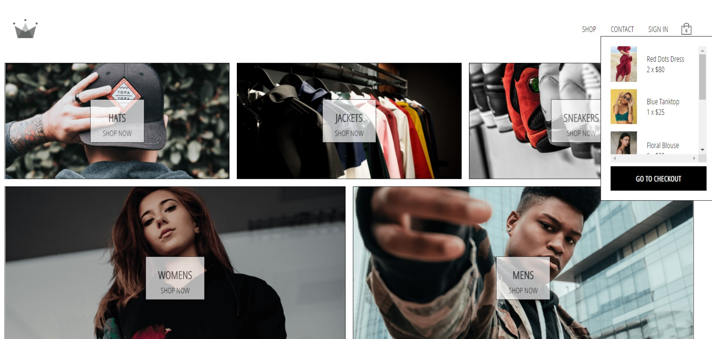

## This project was built during React JS course

# E-commerce platform

This e-commerce project has navigation and routing which takes user to different categories of pages. 
Each item has his own button that allows to add him to a cart. 
All of the added items are displayed in cart dropdown which takes user to checkout page. 
Here is the place to increase, decrease od delete items from cart or start making a payment.
This project has all the functionality to create new user account or sign in with google account.
All the user informations are stored in external serwer- firebase, 
so it is possible to create new profile, sign out and sign in without making a new one.

## Tools & technologies I've used

- Firebase/firestore
- Google sign in authentication
- Redux (selectors, persist, saga, hooks) 
- Local storage
- Stripe payment
- Styled-components
- Responsiveness
- React Lazy
- PWA
- React Enzyme (unit tests)

## My experience

It was the biggest project I have built so far. Few weeks of constant learning about different technologies, frameworks and features
that are connected to React JS gave me a lot of experience with library. Although project contains things that I have mentioned before I also familiarised with **GraphQl and Apollo, thunk middleware and Context API**. 
This project has taught me a number of things. 
One, it has taught me that it is very important to organise all of the components in a **clear structure** that allows easy access to every part. 
Second, I have learnt that there is a lot of tools and technologies that I can use in my code to handle for example fetching data from database or manage state, but it **depends on specific example**. All of it has his own pros and cons, in most cases it will be a **tradeoff**.
Third- components should be written in a **simple way**, that allows to **reuse** them in different part of project and **test**. 
